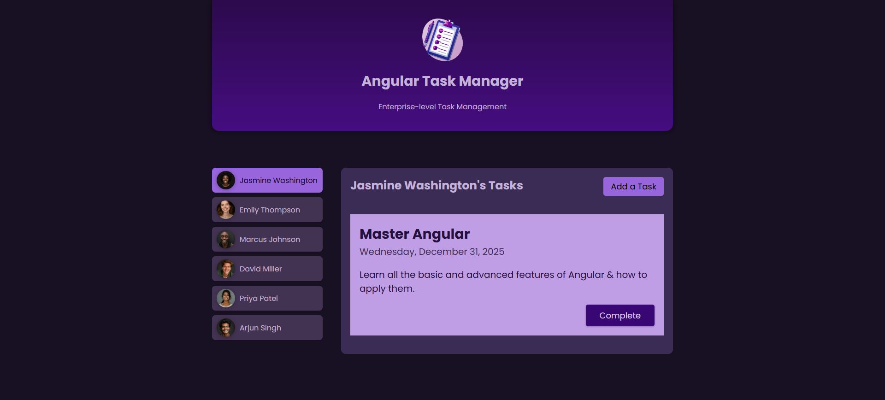
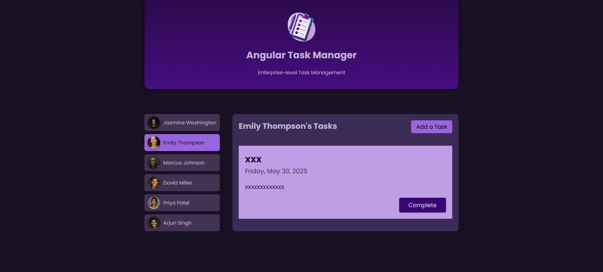
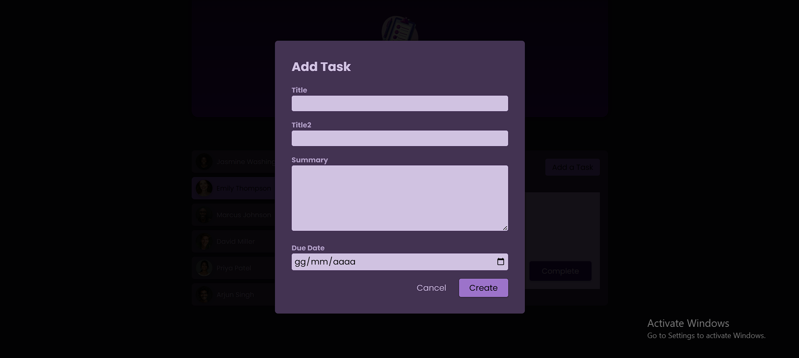
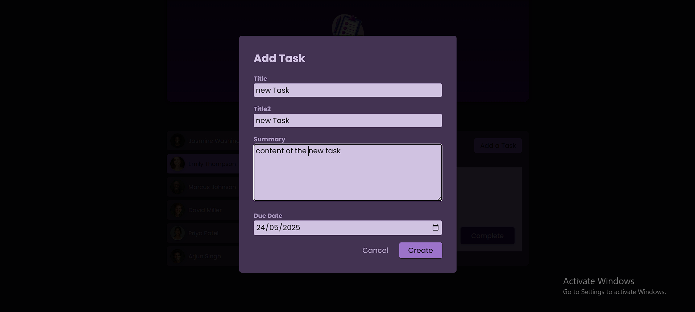
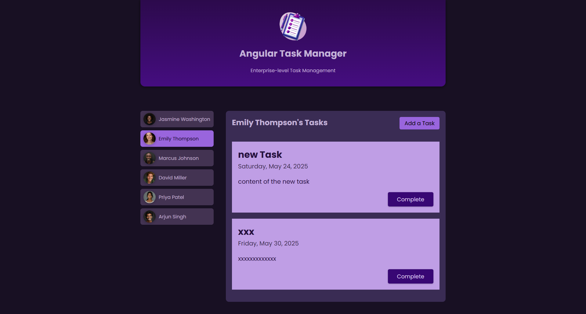
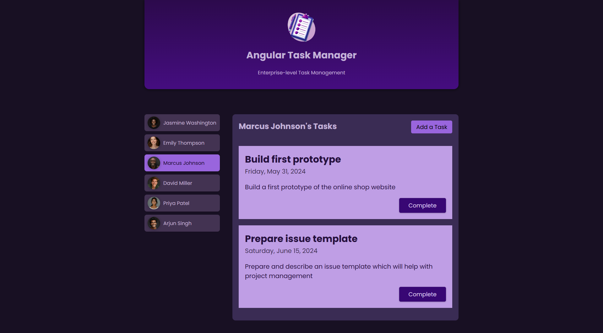

## Angular Task Manager w Signals
Developed project using Angular 17+ and the modern Signals API to create a reactive task management application.
The application enables users to view, add, and complete tasks within a clean, user-specific interface built on a modular architecture.
Reactive data flow is achieved using signal-based inputs and outputs (input.required, output()), ensuring clear and efficient component communication.
Task management is handled through a dedicated TaskService with in-memory storage for simplicity and speed.
Forms utilize FormsModule and ngModel to provide seamless two-way data binding for user input.
Both the modern inject() function and the classic constructor-based approach were used for dependency injection, demonstrating versatility in service usage.

